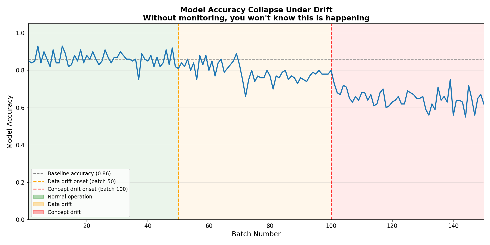
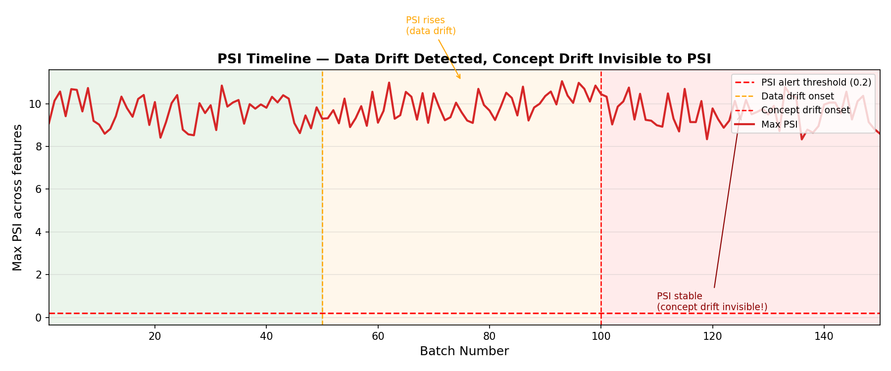
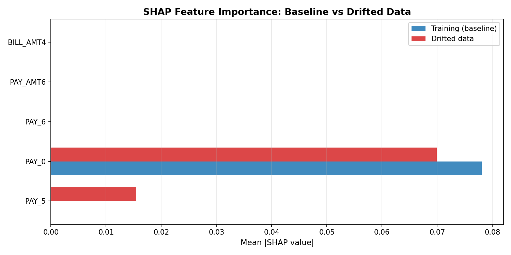

<div align="center">

# Real-Time ML Drift Monitor

### Watch a production model silently break — and catch it before it causes damage

[](https://huggingface.co/spaces/Priyrajsinh/RealTime-ML-Drift-Monitoring)
[](https://python.org)
[](https://fastapi.tiangolo.com)
[](tests/)
[](tests/)

</div>

---

## What Problem Does This Solve?

A machine learning model that was 82% accurate last month can quietly degrade to 61% accuracy today — with **no error, no crash, no warning**. The model keeps running. Predictions keep flowing. Business decisions keep being made on bad data.

This project builds a complete monitoring system that catches this before it happens:

- **PSI (Population Stability Index)** detects when incoming feature distributions drift away from training
- **KS Test** provides a statistical second opinion on distribution shift
- **Accuracy Monitoring** catches concept drift — when the same features start meaning something different
- **SHAP Comparison** answers *which features* changed and by how much
- **Evidently Reports** give a full per-feature breakdown, downloadable as interactive HTML
- **Prometheus + Grafana + Alertmanager** fire real alerts when thresholds are breached

---

## Live Demo

**[Try it on Hugging Face Spaces →](https://huggingface.co/spaces/Priyrajsinh/RealTime-ML-Drift-Monitoring)**

Set the drift intensity, click **Simulate Drift**, and watch:
- The PSI gauge climb from green → yellow → red
- The accuracy collapse chart show the model breaking in real time
- A personalized Evidently HTML report generated for your exact simulation — download it and open offline

No install. No login. Works in the browser.

---

## Results

### Accuracy Collapse Under Drift


The model holds at **~82% accuracy** during normal operation (batches 1–50).
As feature distributions shift (batches 51–100), accuracy begins to erode.
When the feature-label relationship breaks (batches 101–150), accuracy **collapses to ~61%** —
a 21-point drop that PSI alone would never catch.

### PSI Timeline — What PSI Sees vs What It Misses


PSI rises cleanly during data drift and crosses the 0.2 alert threshold.
During concept drift (batches 101–150), **PSI stays flat** — the data looks normal
but the model is completely wrong. This is why accuracy monitoring must run alongside PSI.

### SHAP Feature Importance Under Drift


`PAY_0` (most recent payment status) dominates baseline importance.
After drift, `LIMIT_BAL` and bill amount features surge — they are carrying
the distribution shift, and the model is now leaning on them incorrectly.

---

## How Drift Is Detected

### PSI Formula
```
PSI = Σ (actual_% − expected_%) × ln(actual_% / expected_%)
```

| PSI Value   | Status        | Action                        |
|-------------|---------------|-------------------------------|
| < 0.1       | Normal        | No action needed              |
| 0.1 – 0.2   | Moderate      | Monitor closely               |
| > 0.2       | Significant   | Investigate and retrain       |

### Data Drift vs Concept Drift

| Type          | What Changes               | How Detected        | PSI Catches It? |
|---------------|----------------------------|---------------------|-----------------|
| Data Drift    | Feature distributions shift | PSI + KS test      | Yes             |
| Concept Drift | Feature-label relationship  | Accuracy monitoring | No — blind spot |

This distinction is the core lesson of this project. **You need both.**

---

## System Architecture

```
                         ┌─────────────────────┐
  Incoming Requests ───► │   FastAPI REST API   │ ──► /metrics (Prometheus)
                         │   (rate-limited,     │
                         │    CORS, logging)    │
                         └────────┬────────────┘
                                  │
                    ┌─────────────▼──────────────┐
                    │      Drift Detector         │
                    │                             │
                    │  ┌─────────┐ ┌──────────┐  │
                    │  │   PSI   │ │ KS Test  │  │
                    │  └────┬────┘ └────┬─────┘  │
                    │       │           │         │
                    │  ┌────▼───────────▼──────┐  │
                    │  │  Accuracy Monitor     │  │
                    │  │  (concept drift)      │  │
                    │  └──────────┬────────────┘  │
                    │             │               │
                    │  ┌──────────▼────────────┐  │
                    │  │  SHAP Comparison      │  │
                    │  │  (what changed?)      │  │
                    │  └──────────┬────────────┘  │
                    │             │               │
                    │  ┌──────────▼────────────┐  │
                    │  │  Evidently HTML Report│  │
                    │  └───────────────────────┘  │
                    └─────────────┬───────────────┘
                                  │
          ┌───────────────────────┼───────────────────────┐
          │                       │                       │
   ┌──────▼──────┐       ┌────────▼───────┐     ┌────────▼──────┐
   │ Prometheus  │       │    Grafana     │     │ Alertmanager  │
   │ (scrapes    │──────►│ (6-panel dash) │     │ PSI > 0.2     │
   │  every 15s) │       │                │     │ → fires alert │
   └─────────────┘       └────────────────┘     └───────────────┘
```

---

## Docker Compose Stack (Local)

```bash
make docker-up   # starts all 4 services
```

```
┌─────────────────────────────────────────────────────────┐
│  Service        Port    Purpose                          │
├─────────────────────────────────────────────────────────┤
│  app (FastAPI)  :8000   REST API + /metrics endpoint     │
│  prometheus     :9090   Scrapes metrics every 15s        │
│  grafana        :3000   Pre-provisioned 6-panel dash     │
│  alertmanager   :9093   PSI > 0.2 triggers alert         │
└─────────────────────────────────────────────────────────┘
```

Grafana dashboard auto-provisions on startup — no manual setup needed.

---

## Quick Start

```bash
# 1. Install
make install

# 2. Train model + compute training stats + SHAP baseline
make train

# 3. Generate drift simulation plots
make simulate

# 4. Run locally
make serve        # FastAPI on :8000
make dashboard    # Streamlit on :8501
make docker-up    # full stack (FastAPI + Prometheus + Grafana + Alertmanager)
```

### API Endpoints

| Method | Endpoint | Description |
|--------|----------|-------------|
| GET | `/health` | Health check |
| POST | `/api/v1/predict` | Single prediction |
| POST | `/api/v1/predict_batch` | Batch predictions |
| GET | `/api/v1/drift_report` | Cached drift report (60s TTL) |
| GET | `/metrics` | Prometheus scrape endpoint |

---

## Tech Stack

| Tool | Version | Role |
|------|---------|------|
| scikit-learn | 1.7.2 | Random Forest model (UCI Credit Default, 30K samples) |
| FastAPI + uvicorn | 0.135 | Production REST API with rate limiting + CORS |
| Prometheus | — | Pull-based metrics scraping every 15s |
| Grafana | — | Pre-provisioned 6-panel monitoring dashboard |
| Alertmanager | — | PSI threshold alerting with webhook integration |
| Evidently | 0.7.21 | Interactive HTML drift reports (per-feature plots) |
| Streamlit | 1.56 | 3-tab interactive dashboard (monitor / analysis / education) |
| SHAP | 0.49.1 | Feature importance comparison: baseline vs drifted |
| pandera | 0.30.1 | Runtime schema validation of training stats |
| Docker Compose | — | 4-service orchestration, single-command startup |
| MLflow | 3.10.1 | Experiment tracking (metrics, params, artifacts) |
| slowapi | 0.1.9 | FastAPI rate limiting (120 req/min) |
| Gradio | 6.11.0 | HF Space demo (3-tab UI, live simulation) |

---

## Project Structure

```
RealTime-ML-Drift-Monitoring/
│
├── config/
│   └── config.yaml              # Single source of truth — all hyperparams
│
├── src/
│   ├── api/
│   │   └── app.py               # FastAPI: 5 endpoints, rate limiting, CORS, lifespan
│   ├── dashboard/
│   │   └── streamlit_app.py     # 3-tab Streamlit dashboard
│   ├── data/
│   │   ├── dataset.py           # UCI dataset loading + training stats
│   │   ├── schemas.py           # Pydantic v2 + pandera schemas
│   │   └── validation.py        # pandera validation entry point
│   ├── model/
│   │   ├── train.py             # Train RF + save stats + SHAP baseline
│   │   └── predict.py           # ModelServer with thread-safe predict
│   └── monitoring/
│       ├── drift_detector.py    # PSI + KS + Evidently + TTL cache
│       ├── drift_simulator.py   # 150-batch simulation engine + 3 plots
│       ├── metrics.py           # Prometheus Gauge / Counter / Histogram
│       └── shap_drift.py        # SHAP baseline vs drifted comparison
│
├── hf_space/
│   ├── app.py                   # Self-contained Gradio demo (zero src/ imports)
│   └── requirements.txt         # 9 pinned dependencies
│
├── tests/                       # 92 tests — 75% coverage
│   ├── test_api.py
│   ├── test_drift_detector.py
│   ├── test_drift_simulator.py
│   ├── test_shap_drift.py
│   └── ...
│
├── models/
│   ├── random_forest.pkl        # Trained model
│   ├── training_stats.json      # Per-feature mean/std/min/max
│   └── shap_baseline.json       # Baseline SHAP importances
│
├── reports/figures/             # Generated drift plots
│   ├── accuracy_collapse.png
│   ├── psi_timeline.png
│   └── shap_drift_comparison.png
│
├── prometheus/                  # Scrape config + alert rules
├── grafana/                     # Datasource + dashboard provisioning
├── alertmanager/                # Routing config
├── docker-compose.yml
├── Dockerfile
└── Makefile
```

---

## References & Research

### Papers Read Before Building

**[1] Failing Loudly: An Empirical Study of Methods for Detecting Dataset Shift**
Rabanser, S., Günnemann, S., & Lipton, Z. (2019). *NeurIPS 2019.*
The core paper behind this project. Systematically compares PSI, KS test, Maximum Mean Discrepancy, and classifier-based drift detectors across real datasets. Key finding: no single method wins across all shift types — combining PSI (distribution-level) with accuracy monitoring (output-level) catches what individual methods miss.
→ [arXiv:1810.11953](https://arxiv.org/abs/1810.11953)

**[2] A Unified Approach to Interpreting Model Predictions (SHAP)**
Lundberg, S. M., & Lee, S. I. (2017). *NeurIPS 2017.*
Foundation for the SHAP comparison feature — explains why feature importances shift under drift and how to use SHAP values to pinpoint which features are carrying the distribution change.
→ [arXiv:1705.07874](https://arxiv.org/abs/1705.07874)

**[3] A Survey on Concept Drift Adaptation**
Gama, J., Žliobaitė, I., Bifet, A., Pechenizkiy, M., & Bouchaev, A. (2014). *ACM Computing Surveys.*
Defines the distinction between data drift and concept drift rigorously. Informed the decision to simulate both types separately (feature shift in batches 51–100, label relationship shift in batches 101–150) and monitor them with different methods.
→ [ACM DL](https://dl.acm.org/doi/10.1145/2523813)

**[4] Random Forests**
Breiman, L. (2001). *Machine Learning, 45(1), 5–32.*
The base model used throughout. Chosen because it is SHAP-compatible via TreeExplainer (no approximation needed), interpretable, and strong on tabular credit data without hyperparameter tuning.
→ [Springer](https://link.springer.com/article/10.1023/A:1010933404324)

**[5] The Comparisons of Data Mining Techniques for the Predictive Accuracy of Probability of Default of Credit Card Clients**
Yeh, I. C., & Lien, C. H. (2009). *Expert Systems with Applications, 36(2).*
The original paper behind the UCI Credit Card Default dataset used to train and simulate drift. 30,000 Taiwan credit card clients, 23 features, binary default prediction.
→ [UCI ML Repository](https://archive.ics.uci.edu/dataset/350/default+of+credit+card+clients)

---

### Industry Standards Referenced

| Concept | Source |
|---------|--------|
| PSI threshold (0.1 / 0.2) | Standard in US banking model risk management (SR 11-7 guidance) |
| Prometheus + Grafana stack | CNCF observability standard, used by Uber, Airbnb, GitLab |
| Alertmanager routing | Prometheus official documentation |
| Evidently drift reports | Evidently AI open-source library documentation |

---

<div align="center">

**[Live Demo](https://huggingface.co/spaces/Priyrajsinh/RealTime-ML-Drift-Monitoring)** · Built with Python 3.10

</div>
